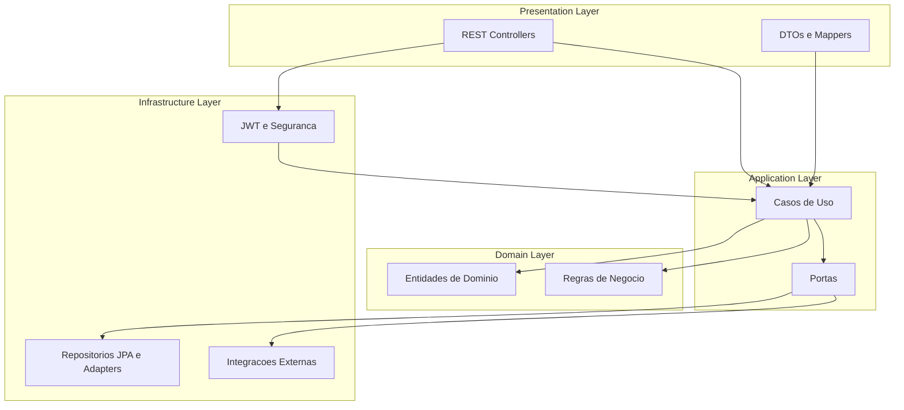
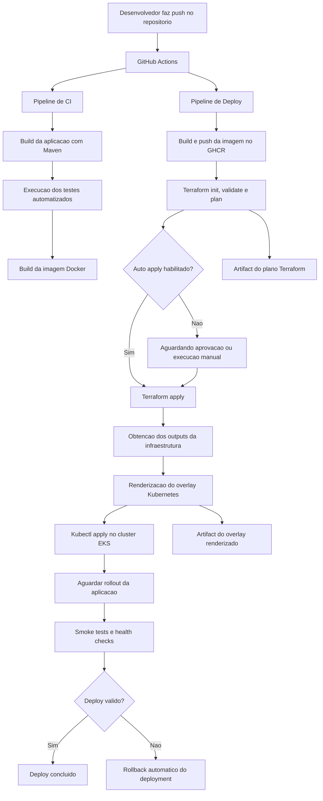

Oficina - Sistema de Gestão de Oficina Mecânica

Visão Geral

Sistema RESTful para gestão completa de uma oficina mecânica, desenvolvido em Spring Boot com autenticação JWT. Permite gerenciar clientes, veículos, ordens de serviço, peças e pagamentos com controle automático de estoque.

Arquitetura

Tecnologias Principais
- **Java 21** - Linguagem de programação
- **Spring Boot 4.0.6** - Framework web
- **Spring Security + JWT** - Autenticação e autorização
- **Spring Data JPA** - Persistência de dados
- **H2 Database** - Banco de dados em memória (desenvolvimento)
- **SpringDoc OpenAPI** - Documentação automática da API
- **Maven** - Gerenciamento de dependências

Estrutura do Projeto
```
src/main/java/io/github/gabrielivo/oficina/
├── application/          # Camada de aplicação (casos de uso)
│   ├── cliente/         # Serviços de cliente
│   ├── ordemServico/    # Serviços de ordem de serviço
│   ├── pagamento/       # Serviços de pagamento
│   ├── peca/           # Serviços de peças
│   ├── usuario/        # Serviços de usuário
│   └── veiculo/        # Serviços de veículo
├── domain/             # Camada de domínio (entidades e regras)
│   ├── cliente/        # Entidades Cliente e Endereco
│   ├── ordemServico/   # Entidades OrdemServico, ItemOrdemServico
│   ├── pagamento/      # Entidade Pagamento
│   ├── peca/          # Entidade Peca
│   ├── usuario/       # Entidade Usuario
│   └── veiculo/       # Entidade Veiculo
├── infrastructure/     # Camada de infraestrutura
│   ├── security/      # Configurações de segurança JWT
│   └── seeder/        # Dados iniciais
└── presentation/       # Camada de apresentação (controllers REST)
    ├── auth/          # Autenticação
    ├── cliente/       # Endpoints de cliente
    ├── ordemServico/  # Endpoints de OS
    ├── pagamento/     # Endpoints de pagamento
    ├── peca/         # Endpoints de peças
    └── veiculo/      # Endpoints de veículo
```

Domínios de Negócio

1 Usuário 
- **Responsabilidade**: Autenticação e autorização no sistema
- **Atributos**: login, senha
- **Funcionalidades**: Login JWT, validação de credenciais

2 Cliente
- **Responsabilidade**: Representar os clientes da oficina
- **Atributos**: CPF, nome, telefone, endereço
- **Funcionalidades**: CRUD completo, validação de CPF único

3 Endereço 
- **Responsabilidade**: Informações de localização dos clientes
- **Atributos**: CEP, logradouro, número, complemento, bairro, cidade, UF
- **Relacionamento**: 1:1 com Cliente (cascade persist)

4 Veículo 
- **Responsabilidade**: Veículos dos clientes
- **Atributos**: placa, marca, modelo, ano
- **Relacionamento**: N:1 com Cliente
- **Regras**: Placa única no sistema

5 Peça 
- **Responsabilidade**: Controle de estoque de peças
- **Atributos**: nome, descrição, preço, quantidade em estoque, estoque mínimo
- **Funcionalidades**:
  - Controle automático de estoque
  - Alertas de estoque baixo/crítico
  - Reposição manual de estoque
  - Redução automática ao usar em OS

6 Ordem de Serviço 
- **Responsabilidade**: Gerenciamento completo do workflow de serviços
- **Atributos**: cliente, veículo, status, valor total, itens
- **Relacionamento**: 1:N com ItemOrdemServico

7 Item de Ordem de Serviço 
- **Responsabilidade**: Itens específicos de uma OS (serviços ou peças)
- **Atributos**: descrição, tipo (SERVIÇO/PEÇA), valor, quantidade, peça (opcional)
- **Funcionalidades**: Cálculo automático de valor total

8 Pagamento 
- **Responsabilidade**: Registro de pagamentos das OS
- **Atributos**: valor, forma de pagamento (PIX, DINHEIRO, CARTÃO)
- **Relacionamento**: 1:1 com OrdemServico

Fluxos de Processamento

Autenticação JWT 
1. **Login**: Cliente envia login/senha
2. **Validação**: Sistema verifica credenciais
3. **Token**: Gera JWT com expiração de 30 minutos
4. **Acesso**: Cliente usa token em Authorization header

Controle de Estoque 
1. **Cadastro de Peça**: Define estoque mínimo
2. **Uso em OS**: Reduz automaticamente estoque ao adicionar peça
3. **Cancelamento OS**: Restaura estoque automaticamente
4. **Alertas**: Sistema identifica peças com estoque baixo/crítico
5. **Reposição**: Permite reposição manual via endpoint

Validações de Negócio 
- **CPF único** por cliente
- **Placa única** por veículo
- **Transições de status** válidas na OS
- **Estoque suficiente** antes de usar peça
- **Campos obrigatórios** em todas as entidades

Workflow de Ordem de Serviço

#Estados da Ordem de Serviço
```
RECEBIDA → EM_DIAGNOSTICO → AGUARDANDO_APROVACAO → EM_EXECUCAO → FINALIZADA → ENTREGUE
```

Fluxo Completo

1 **RECEBIDA**
- Estado inicial ao criar OS
- Cliente e veículo já cadastrados
- Valor total = R$ 0,00

2 **EM_DIAGNOSTICO** 
- Adição de itens de diagnóstico
- Serviços e peças podem ser adicionadas
- Estoque reduzido automaticamente para peças
- Valor total recalculado automaticamente

3 **AGUARDANDO_APROVACAO** 
- Diagnóstico concluído
- Cliente aprova orçamento
- Itens podem ser ajustados se necessário

4 **EM_EXECUCAO** 
- Serviços sendo executados
- Peças sendo utilizadas
- Novos itens podem ser adicionados

5 **FINALIZADA** 
- Serviços concluídos
- Não permite mais alterações
- Pronto para entrega/pagamento

6 **ENTREGUE**
- Veículo entregue ao cliente
- Estado final, não permite alterações

Operações Permitidas por Status

| Operação | RECEBIDA | DIAG | APROV | EXEC | FINAL | ENTREGUE |
|----------|----------|------|-------|------|-------|----------|
| Adicionar Item | ✅ | ✅ | ✅ | ✅ | ❌ | ❌ |
| Remover Item | ✅ | ✅ | ✅ | ✅ | ❌ | ❌ |
| Alterar Item | ✅ | ✅ | ✅ | ✅ | ❌ | ❌ |
| Avançar Status | ✅ | ✅ | ✅ | ✅ | ✅ | ❌ |
| Cancelar | ✅ | ✅ | ❌ | ❌ | ❌ | ❌ |
| Pagar | ❌ | ❌ | ❌ | ❌ | ✅ | ✅ |

Cancelamento e Estoque
- **Cancelamento**: Só permitido até EM_EXECUCAO
- **Restauração**: Estoque das peças é automaticamente restaurado
- **Limpeza**: Todos os itens são removidos da OS

Como Executar

Pré-requisitos
- Java 21+
- Maven 3.6+

Executar em Desenvolvimento
```bash
# Compilar
./mvnw clean compile

# Executar testes
./mvnw test

# Executar aplicação
./mvnw spring-boot:run
```

Testar e-mails localmente
```bash
# Subir o banco e o MailHog
docker compose up -d postgres mailhog

# Habilitar envio de e-mail
# no application.properties:
# app.mail.enabled=true
# app.mail.to=seu-email@dominio.com

# Acompanhar mensagens em
# http://localhost:8025
```

Acessar a Aplicação
- **API Base**: http://localhost:8080
- **Swagger UI**: http://localhost:8080/swagger-ui.html
- **API Docs**: http://localhost:8080/v3/api-docs

Dados Iniciais
A aplicação cria automaticamente:
- Usuário admin: `login=admin` | `senha=admin123`
- Peças de exemplo com controle de estoque

API Endpoints

Autenticação
- `POST /auth/login` - Login e geração de token JWT

Clientes
- `GET /clientes` - Listar todos
- `POST /clientes` - Criar novo
- `GET /clientes/{id}` - Buscar por ID
- `PUT /clientes/{id}` - Atualizar
- `DELETE /clientes/{id}` - Remover

Veículos
- `GET /veiculos` - Listar todos
- `POST /veiculos` - Criar novo
- `GET /veiculos/{id}` - Buscar por ID
- `PUT /veiculos/{id}` - Atualizar
- `DELETE /veiculos/{id}` - Remover

Peças
- `GET /pecas` - Listar todas
- `POST /pecas` - Criar nova
- `GET /pecas/{id}` - Buscar por ID
- `PUT /pecas/{id}` - Atualizar
- `DELETE /pecas/{id}` - Remover
- `POST /pecas/{id}/repor-estoque` - Repor estoque
- `GET /pecas/estoque-baixo` - Peças com estoque baixo
- `GET /pecas/estoque-critico` - Peças com estoque crítico

Ordens de Serviço
- `GET /ordens-servico` - Listar ordens ativas com ordenação por prioridade de status
- `POST /ordens-servico` - Criar nova OS com cliente, veículo, serviços e peças
- `GET /ordens-servico/{id}` - Buscar por ID
- `GET /ordens-servico/{id}/status` - Consultar status atual
- `POST /ordens-servico/{id}/aprovacao-orcamento` - Aprovar ou recusar orçamento
- `PUT /ordens-servico/{id}/avancar-status` - Avançar status
- `POST /ordens-servico/{id}/itens` - Adicionar item
- `DELETE /ordens-servico/{id}/itens/{itemId}` - Remover item
- `POST /ordens-servico/{id}/cancelar` - Cancelar OS

Exemplo de abertura de OS
```json
{
  "clienteId": "cliente-1",
  "veiculoId": "veiculo-1",
  "itens": [
    {
      "descricao": "Troca de óleo",
      "tipo": "SERVICO",
      "valor": 80.00
    },
    {
      "descricao": "Filtro de óleo",
      "tipo": "PECA",
      "valor": 25.00,
      "quantidade": 2,
      "pecaId": "peca-1"
    }
  ]
}
```

Exemplo de resposta de orçamento
```json
{
  "aprovado": true,
  "observacao": "Cliente aprovou o orçamento"
}
```

Pagamentos
- `GET /pagamentos` - Listar todos
- `POST /pagamentos` - Criar novo
- `GET /pagamentos/{id}` - Buscar por ID

Testes

Executar Todos os Testes
```bash
./mvnw test
```

Executar Testes Específicos
```bash
# Testes de peça
./mvnw test -Dtest="*Peca*"

# Testes de ordem de serviço
./mvnw test -Dtest="*OrdemServico*"

# Teste específico
./mvnw test -Dtest="PecaServiceTest"
```

Cobertura de Testes
- **PecaTest**: Testes unitários da entidade Peca
- **OrdemServicoServiceTest**: Testes de serviço de OS
- **PecaControllerTest**: Testes de controller REST
- **ClienteControllerTest**: Testes de controller REST

Segurança

JWT Authentication
- **Token Expiration**: 30 minutos
- **Header**: `Authorization: Bearer {token}`
- **Endpoints Protegidos**: Todos exceto login e documentação

Endpoints Públicos
- `/` - Página inicial
- `/auth/**` - Autenticação
- `/v3/api-docs/**` - Documentação OpenAPI
- `/swagger-ui/**` - Interface Swagger
- `/actuator/**` - Health checks

Banco de Dados

H2 (Desenvolvimento)
- **URL**: `jdbc:h2:mem:oficina`
- **Console**: http://localhost:8080/h2-console
- **Username**: `sa`
- **Password**: *(vazio)*

Configuração JPA
- **DDL Auto**: `update` (cria/atualiza tabelas automaticamente)
- **Dialect**: H2Dialect
- **Show SQL**: Desabilitado em produção

Monitoramento

Spring Boot Actuator
- **Health Check**: `/actuator/health`
- **Info**: `/actuator/info`
- **Metrics**: `/actuator/metrics`

Configurações Importantes

application.properties
```properties
# JWT
jwt.expiration=1800000
jwt.secret=sua-chave-secreta-deve-ter-pelo-menos-256-bits-aqui

# Banco H2
spring.datasource.url=jdbc:h2:mem:oficina;DB_CLOSE_DELAY=-1;DB_CLOSE_ON_EXIT=FALSE
spring.jpa.hibernate.ddl-auto=update

# Swagger
springdoc.api-docs.path=/v3/api-docs
springdoc.swagger-ui.path=/swagger-ui.html
```

Deploy

Para Produção
1. **Banco**: Configurar MySQL/PostgreSQL
2. **JWT Secret**: Usar chave segura de 256+ bits
3. **Profiles**: Criar profile `prod`
4. **Build**: `./mvnw clean package -Dspring.profiles.active=prod`

Docker (Opcional)
```yaml
# docker-compose.yml
version: '3.8'
services:
  oficina:
    build: .
    ports:
      - "8080:8080"
    environment:
      - SPRING_PROFILES_ACTIVE=prod
```

Parte 2 - Entregas Realizadas Hoje

1. APIs criadas

- Abertura de Ordem de Serviço (OS): recebimento de dados de cliente, veículo, serviços e peças, retornando identificação única da OS.
- Consulta de status da OS: situação atual da OS, contemplando Recebida, Diagnóstico, Aguardando Aprovação, Execução, Finalizada e Entregue.
- Aprovação de orçamento: endpoint para receber notificações externas de aprovação ou recusa de orçamento do cliente.
- Listagem de ordens de serviço com as regras:
- Ordenação por status: Em Execução > Aguardando Aprovação > Diagnóstico > Recebida.
- Mais antigas primeiro.
- Exclusão lógica da listagem para OS finalizadas e entregues.
- Atualização de status da OS via ferramenta externa, como e-mail.

2. Refatoração arquitetural

- Refatoração do projeto com foco em arquitetura baseada em Clean Architecture.
- Melhor separação de responsabilidades entre domínio, aplicação, apresentação e infraestrutura.

Diagrama da arquitetura de código (Clean Architecture)



3. CI/CD e automação de infraestrutura

- Configuração de CI/CD com GitHub Actions.
- Uso de scripts de automação para deploy.
- Integração com Terraform para provisionamento de infraestrutura e pipeline de entrega.

Diagrama do fluxo de deploy



Parte 3 - Instruções de Execução e Entrega

Instruções para execução local

```bash
# instalar dependências e validar projeto
./mvnw clean test

# executar API localmente
./mvnw spring-boot:run
```

Endpoints locais:
- API: http://localhost:8080
- Swagger UI: http://localhost:8080/swagger-ui.html
- OpenAPI JSON: http://localhost:8080/v3/api-docs

Instruções para deploy em Kubernetes

```bash
# deploy direto no ambiente dev
kubectl apply -k k8s/overlays/dev
```

Opção com render/deploy usando outputs do Terraform:

```bash
DB_PASSWORD="<senha_db>" scripts/deploy_k8s_overlay.sh hml infra/terraform/environments/dev
```

Instruções para provisionamento da infraestrutura com Terraform

```bash
cd infra/terraform/environments/dev
cp terraform.tfvars.example terraform.tfvars
terraform init
terraform validate
terraform plan -var-file=terraform.tfvars
terraform apply -var-file=terraform.tfvars
```

Link para a collection completa das APIs

- Swagger UI: http://localhost:8080/swagger-ui.html
- OpenAPI (importável no Postman/Insomnia): http://localhost:8080/v3/api-docs
- Em ambiente remoto, substitua `localhost:8080` pelo host publicado.

Licença

Este projeto está sob a licença MIT. Veja o arquivo `LICENSE` para mais detalhes.
