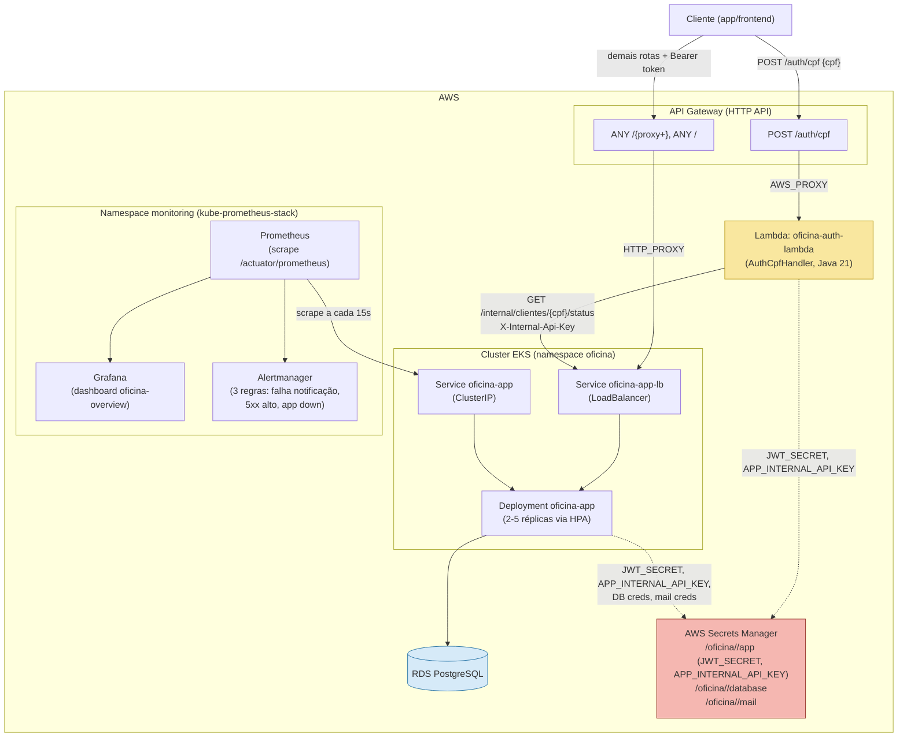

# Diagrama de Componentes

Visão de nuvem completa do sistema: API Gateway, function serverless de
autenticação, cluster Kubernetes com a aplicação principal, banco gerenciado,
e a stack de observabilidade. Ver `documentacao/plano_implementacao.md` para
o detalhamento de cada peça e `documentacao/infraestrutura.md` para os passos
de deploy.

## Mapeamento para os 4 repositórios (seção 5 do plano)

| Componente no diagrama | Repositório-alvo |
|---|---|
| `Lambda: oficina-auth-lambda` | 1. `oficina-auth-lambda` |
| `API Gateway`, EKS (Terraform: cluster, HPA, Service externo) | 2. `oficina-infra-k8s` |
| `RDS PostgreSQL` (Terraform) | 3. `oficina-infra-db` |
| `Deployment oficina-app`, `Service oficina-app`/`oficina-app-lb`, código Spring Boot | 4. `oficina-app` |

Cada um desses repositórios terá seu próprio pipeline de CI/CD (build + testes
+ deploy automático), conforme detalhado na seção 5 do plano de implementação.
