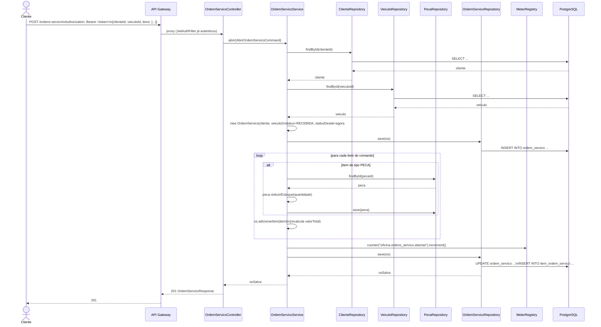

# Diagrama de Sequência — Abertura de Ordem de Serviço

Fluxo de `POST /ordens-servico`, a partir de um cliente já autenticado (ver
`documentacao/diagrama_sequencia_auth.md`). Cobre o caminho feliz com um item
do tipo `PECA` (que reduz estoque) e a métrica de negócio registrada na
abertura.

## Pontos de decisão relevantes

- **Estoque é debitado na abertura, não depois**: `PecaRepository.save` roda
  dentro da mesma transação de `abrir()` — se qualquer passo falhar depois, a
  transação inteira (incluindo a redução de estoque) é revertida.
- **`statusDesde` != `atualizadoEm`**: `statusDesde` só muda em transições de
  status (`avancarStatus`, `responderOrcamento`, `atualizarStatusExterno`); é
  o campo usado para calcular a métrica
  `oficina_ordens_servico_tempo_no_status_seconds` (ver
  `documentacao/infraestrutura.md`, seção de observabilidade).
- **Métrica de negócio no mesmo fluxo transacional**: o incremento do counter
  `oficina.ordens_servico.abertas` acontece antes do `save` final, mas não
  depende dele — Micrometer não participa da transação JPA (se o `save` final
  falhar e o rollback ocorrer, o contador já incrementado não é desfeito; é
  uma imprecisão aceita, não uma garantia de exatidão contábil).
