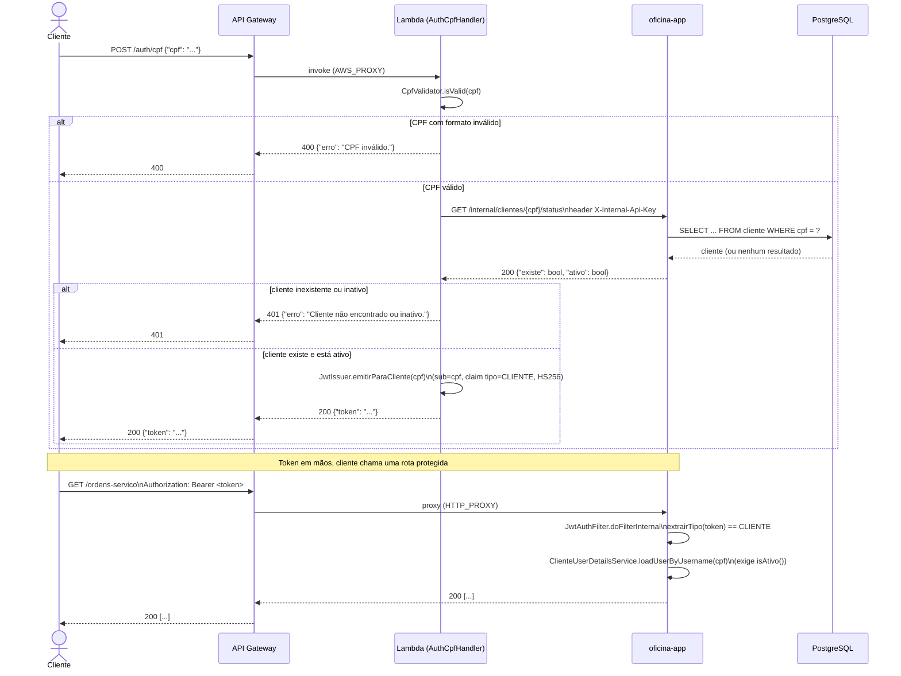

# Diagrama de Sequência — Autenticação por CPF

Fluxo completo desde a chamada do cliente até o uso do token emitido em uma
rota protegida da aplicação principal. Ver o README do repositório
`oficina-auth-lambda` para o detalhamento do Lambda, e
`src/main/java/.../infrastructure/security/` neste repositório para o lado da
aplicação (`JwtAuthFilter`, `ClienteUserDetailsService`).

## Pontos de decisão relevantes

- **Mensagens de erro genéricas em 401**: não se distingue "não existe" de
  "inativo" para não permitir enumerar CPFs cadastrados (ver o README do
  repositório `oficina-auth-lambda`).
- **Verificação dupla de status**: `ClienteUserDetailsService` volta a checar
  `isAtivo()` a cada requisição autenticada — um cliente inativado depois de
  emitido o token deixa de conseguir usá-lo antes do `exp`, mesmo com
  assinatura válida.
- **Chave interna, não JWT**: a chamada do Lambda para
  `/internal/clientes/{cpf}/status` usa `X-Internal-Api-Key`, nunca um JWT —
  nesse ponto o cliente ainda não tem token nenhum.
