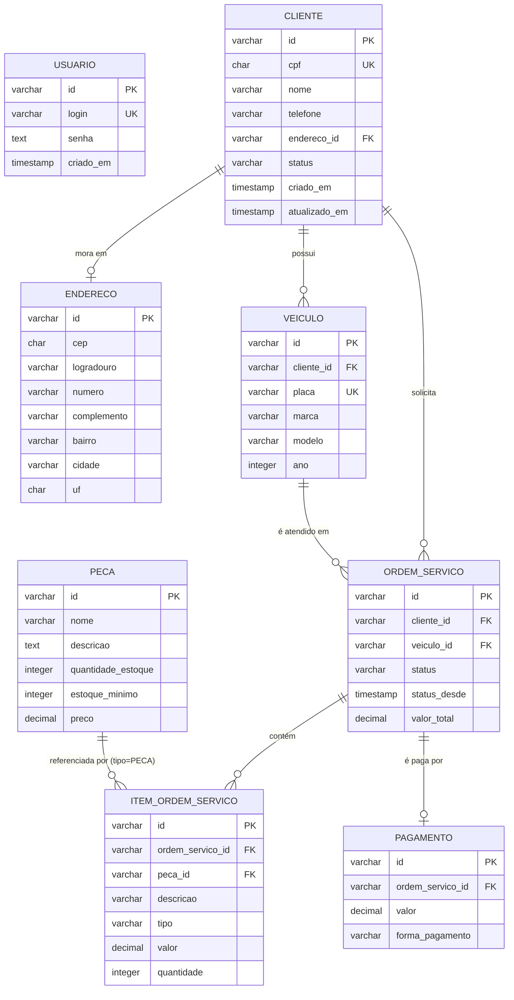

# Modelo de Dados

```dbml
Table usuario {
  id varchar(36) [primary key] // UUID.toString()
  login varchar(100) [unique, not null]
  senha text [not null]
  criado_em timestamp
}

Table cliente {
  id varchar(36) [primary key] // UUID.toString()
  cpf char(11) [unique, not null]
  nome varchar(150) [not null]
  telefone varchar(20)
  endereco_id varchar(36) [ref: > endereco.id]
  status varchar(20) [not null, default: 'ATIVO'] // ATIVO, INATIVO — consultado pelo lambda de autenticação por CPF
  criado_em timestamp
  atualizado_em timestamp
}

Table endereco {
  id varchar(36) [primary key] // UUID.toString()
  cep char(8)
  logradouro varchar(150)
  numero varchar(20)
  complemento varchar(100)
  bairro varchar(100)
  cidade varchar(100)
  uf char(2)
  criado_em timestamp
  atualizado_em timestamp
}

Table veiculo {
  id varchar(36) [primary key] // UUID.toString()
  cliente_id varchar(36) [not null, ref: > cliente.id]
  placa varchar(10) [unique, not null]
  marca varchar(100) [not null]
  modelo varchar(100) [not null]
  ano integer
  criado_em timestamp
  atualizado_em timestamp
}

Table peca {
  id varchar(36) [primary key] // UUID.toString()
  nome varchar(150) [not null]
  descricao text
  quantidade_estoque integer [not null, default: 0]
  estoque_minimo integer [not null, default: 0]
  preco decimal(10,2)
  criado_em timestamp
  atualizado_em timestamp
}

Table ordem_servico {
  id varchar(36) [primary key] // UUID.toString()
  cliente_id varchar(36) [not null, ref: > cliente.id]
  veiculo_id varchar(36) [not null, ref: > veiculo.id]
  status varchar(30) [not null] // RECEBIDA, EM_DIAGNOSTICO, AGUARDANDO_APROVACAO, EM_EXECUCAO, FINALIZADA, ENTREGUE
  status_desde timestamp // atualizado só em transição de status; base da métrica de tempo médio por status
  valor_total decimal(10,2)
  criado_em timestamp
  atualizado_em timestamp
}

Table item_ordem_servico {
  id varchar(36) [primary key] // UUID.toString()
  ordem_servico_id varchar(36) [not null, ref: > ordem_servico.id]
  peca_id varchar(36) [ref: > peca.id]
  descricao varchar(150) [not null]
  tipo varchar(10) [not null] // SERVICO, PECA
  valor decimal(10,2) [not null]
  quantidade integer
}

Table pagamento {
  id varchar(36) [primary key] // UUID.toString()
  ordem_servico_id varchar(36) [not null, ref: > ordem_servico.id]
  valor decimal(10,2) [not null]
  forma_pagamento varchar(30) // PIX, DINHEIRO, CARTAO
  criado_em timestamp
}
```

O bloco acima está em [DBML](https://dbml.dbdiagram.io/) — cole em
dbdiagram.io para uma visualização interativa. O diagrama abaixo (Mermaid)
renderiza direto no GitHub/GitLab, sem ferramenta externa:



## Justificativa da escolha do banco (PostgreSQL/RDS)

Ver `documentacao/rfcs/0002-escolha-do-banco-gerenciado.md` para a justificativa
formal completa (tipos de dados usados no schema, integridade referencial sob
concorrência, custo/maturidade no RDS, alternativas descartadas). Resumo: o
modelo é fortemente relacional — abrir uma OS com item do tipo `PECA` decrementa
estoque na mesma transação, pagamento é 1:1 com OS, e há múltiplas constraints
`UNIQUE`/`NOT NULL` que dependem de integridade referencial real — PostgreSQL
atende isso nativamente sem desnormalização.

## Relacionamentos entre os módulos

- **`cliente` ↔ `endereco`** (1:0..1): um cliente pode não ter endereço
  cadastrado (`endereco_id` é opcional); quando existe, é gerenciado com
  `CascadeType.ALL` a partir de `Cliente` (não existe `EnderecoRepository`
  independente sendo usado fora desse relacionamento).
- **`cliente` ↔ `veiculo`** (1:N): um cliente pode ter vários veículos;
  `Veiculo.cliente_id` é `NOT NULL` — não existe veículo "órfão".
- **`cliente`/`veiculo` ↔ `ordem_servico`** (1:N cada): toda OS pertence a
  exatamente um cliente e um veículo, ambos obrigatórios na criação
  (`OrdemServicoService.abrir` busca os dois antes de instanciar a OS).
- **`ordem_servico` ↔ `item_ordem_servico`** (1:N): itens são o único jeito de
  compor o `valor_total` da OS (`OrdemServico.recalcularTotal`); um item do
  tipo `SERVICO` não referencia peça, um item do tipo `PECA` referencia
  exatamente uma (`ItemOrdemServico`/`domain/ordemServico/AdicionarItemCommand`
  validam essa regra).
- **`peca` ↔ `item_ordem_servico`** (1:N, opcional): só itens do tipo `PECA`
  têm `peca_id` preenchido; adicionar um item desses decrementa
  `peca.quantidade_estoque` (`PecaService`/`OrdemServicoService`), removê-lo
  ou cancelar a OS repõe o estoque.
- **`ordem_servico` ↔ `pagamento`** (1:0..1): pagamento só é permitido quando
  a OS está `FINALIZADA` ou `ENTREGUE` (regra em `OrdemServicoService`), e uma
  OS tem no máximo um pagamento associado.
- **`usuario`**: isolado do restante do modelo — não referencia nem é
  referenciado por `cliente`/`ordem_servico`/etc. Representa login de
  staff/admin (ver `domain/usuario/`), um modelo de credencial
  completamente separado do de `cliente` (ver
  `documentacao/rfcs/0003-estrategia-de-autenticacao.md`).
